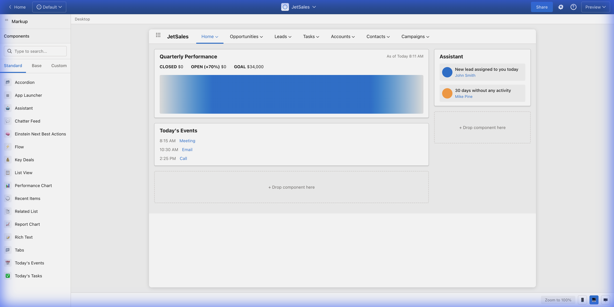

# Masquerade

**A Salesforce UI Mockup and Wireframing Tool** - Lightning App Builder style interface for designing Salesforce applications.



## Features

- 🎨 **Lightning App Builder UI** - Familiar Salesforce-style interface
- 📦 **24+ OOB Components** - Standard Salesforce components ready to use
- 🖱️ **Drag & Drop** - Build layouts by dragging components to regions
- 🎯 **Region-Based Canvas** - Main and Sidebar drop zones like real SF
- 💅 **Official SLDS Styling** - Uses @salesforce-ux/design-system

## Quick Start

```bash
# Install dependencies
npm install

# Start development server
npm run dev
```

Open http://localhost:5173 in your browser.

## Tech Stack

- **React 18** + TypeScript
- **Vite** for fast development
- **@salesforce-ux/design-system** for authentic Salesforce styling
- **react-konva** for canvas interactions

## Project Structure

```
src/
├── App.tsx                    # Main Lightning App Builder UI
├── styles/
│   └── builder.css           # Builder chrome styles
├── types/
│   └── oob-components.ts     # OOB component definitions
└── components/
    └── slds/                 # SLDS component wrappers
```

## Roadmap

- [ ] Template picker (Record Page, Home Page, App Page)
- [ ] Property panel for component configuration
- [ ] More OOB components (Related List, Path, Highlights Panel)
- [ ] Export to PNG/PDF
- [ ] Save/Load designs

## License

MIT
